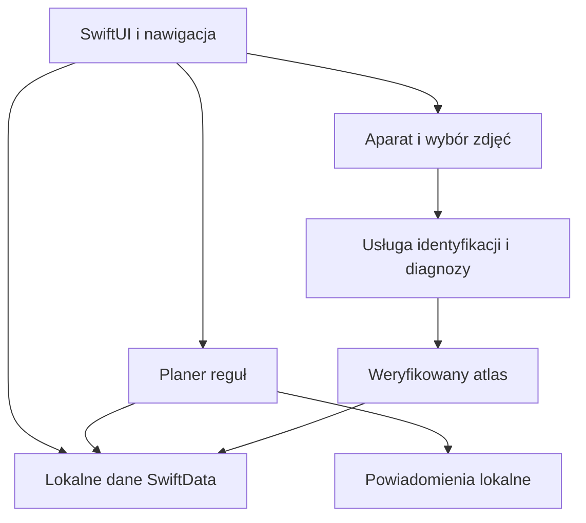

# Architektura i plan implementacji Pędów

Stan: 1 października 2026. Źródłem zakresu funkcjonalnego jest [plan widoków](widoki.md). Rozstrzygnięcia w tym dokumencie można zmienić po pierwszym uruchomieniu w Xcode; wynik testów na macOS jest bramką etapu 1.

## Cel i reguły produktu

Natywna aplikacja iOS w SwiftUI, po polsku, z lokalną kolekcją. Użytkownik zatwierdza gatunek wskazany na zdjęciu. Kontrola wilgotności jest zdarzeniem innym niż podlewanie. AI pomaga rozpoznać gatunek i uszeregować hipotezy diagnozy, a harmonogram działa deterministycznie na jawnych regułach. Brak danych o gatunku albo warunkach jest widoczny, a nie zastępowany domysłem.

## Moduły i przepływ danych

- **Interfejs:** cztery zakładki oraz szczegółowe widoki z planu; funkcje sieciowe pokazują stan oczekiwania/błędu/niepewności.
- **Lokalne dane:** SwiftData dla egzemplarzy, zdarzeń, stanowisk, preferencji, przypadków diagnozy i postępu sesji. Zdjęcia jako pliki w kontenerze aplikacji, w bazie tylko identyfikator/ścieżka. W pierwszym fragmencie są `Plant` i `CareEvent`; modele innych modułów dochodzą wraz z etapami.
- **Atlas:** wersjonowany pakiet zweryfikowanych gatunków, nazw/synonimów, instrukcji i źródeł. Potem opcjonalna aktualizacja z serwera, z lokalną kopią do odczytu offline. Bez licencjonowanych fotografii i sprawdzonych tekstów atlas nie przechodzi bramki wydania.
- **Planer:** czyste reguły `CareWindow(earliest, preferred, latest, priority)`, grupowanie po dniach, stan zależności zadania, ponowne wyliczenie po każdym wpisie. Pierwszy fragment zawiera tylko kontrolę podłoża i okno dwóch dni; to demonstracja mechanizmu, nie komplet reguł ogrodniczych.
- **Powiadomienia:** lokalne przypomnienie o sesji, po przeliczeniu planu anulowanie i ponowne założenie odpowiednich identyfikatorów. Żądanie zgody w kontekście włączenia funkcji. Testy restartu, zmiany czasu i wyłączonej zgody.
- **Usługa analizy zdjęć:** cienki backend pośredniczący trzyma klucz dostawcy, ogranicza rozmiar/liczbę zdjęć, rozdziela identyfikację od diagnozy, zwraca ustrukturyzowane kandydatury z niepewnością i błędem. Decyzję o dostawcy podejmujemy po próbie jakości na realnych przykładach i oszacowaniu kosztów. Bez ustawionego backendu podstawowe funkcje lokalne nadal działają.

## Kontrakt przyszłego backendu

`POST /v1/identify` przyjmuje 1–3 zdjęcia i identyfikator żądania. Odpowiedź: wersja schematu, lista kandydatów z ID gatunku w atlasie lub statusem nieznany, wskazówki odróżniające, poziom niepewności, informacja o ewentualnej potrzebie kolejnego ujęcia. Kandydat nigdy nie zapisuje się bez zatwierdzenia.

`POST /v1/diagnose` przyjmuje zdjęcia, opis objawu i potwierdzony kontekst pielęgnacji. Odpowiedź: hipotezy, przesłanki za/przeciw, brakujące informacje, proponowane bezpieczne kontrole, stan `needs_more_info` lub `inconclusive`. Klient pokazuje ograniczenia i pozwala wybrać, które czynności dodać do planu. Backend ma wersjonowane odpowiedzi, idempotencyjny identyfikator żądania i kontrolę kosztu/limitów. Dane wysyłane po wyraźnej akcji użytkownika; retencja i usuwanie do określenia z wybranym dostawcą przed uruchomieniem.

## Algorytm i inwarianty

1. Generuj przyszłe okna czynności z wymagań gatunku, warunków egzemplarza, sezonu i ostatnich faktycznych zdarzeń. `Nie wiem` nie tworzy zdarzenia podlewania.
2. Wyznacz daty sesji w przecięciu okien. Preferuj więcej zadań jednego dnia, następnie preferowany dzień tygodnia, bez przechodzenia za `latest` żadnego zadania. Pilna kontrola poza przecięciem jest osobna.
3. Przy jednej roślinie połącz powiązane kontrole w logicznej kolejności. Podlewanie jest dostępne po ocenie podłoża, ale zapisuje się dopiero po wykonaniu.
4. Przy zapisie lub korekcie historii przelicz tylko przyszłe zadania i powiadomienia; historia i zdjęcia z datami pozostają audytowalne.
5. Odtwarzaj rozpoczętą sesję po wyjściu z aplikacji. Identyfikatory zadań są stabilne, aby nie dublować zapisu ani powiadomień.

Testy planera: osobne daty bez przecięcia, granice okien, preferencja dnia, kilka zadań przy jednej roślinie, zaległości, zmiana strefy/DST, korekta i usunięcie wpisu, brak podwójnego podlewania. Testy aplikacji: dodanie, zamknięcie/ponowne uruchomienie, zapis wyniku, nawigacja wstecz i duży tekst.

## Kolejność wykonania i bramki

| Etap | Zakres | Gotowe, gdy… |
|---|---|---|
| 0. Fundament | Repo, projekt XcodeGen, SwiftUI, SwiftData, testy, CI | Projekt buduje się na macOS, testy przechodzą i aplikacja otwiera się w symulatorze |
| 1. Pierwszy przepływ | Dodanie ręczne, lista/profil, plan, szczegół kontroli, wilgotne/suche/nie wiem, zapis podlewania, historia | Zamknięcie aplikacji nie usuwa danych; wilgotne odracza kontrolę, suche nie udaje podlewania; sesje mieszczą się w oknach |
| 2. Atlas i instrukcje | Treści, źródła, zdjęcia referencyjne, filtry, dopasowanie do stanowiska, zapisy do zakupu | Wszystkie wskazówki mają ID gatunku i źródło; nieznana toksyczność ma stan „brak danych” |
| 3. Pełny planer | Nawożenie i inne czynności, preferencje, historia/korekta, powiadomienia, wyjazd | Zmiany danych odświeżają przyszłe sesje i przypomnienia; granice okien oraz zaległości przetestowane |
| 4. Zdjęcia i identyfikacja | Zdjęcia, kadrowanie, backend, kandydaci, potwierdzenie lub wpis nierozpoznany | Niepewne/nieudane rozpoznanie nie blokuje kolekcji, dane lokalne zostają po błędzie |
| 5. Diagnoza | Zdjęcia objawów, pytania, hipotezy, zalecane kontrole, przebieg przypadku | Niepewność widoczna; wynik nie zapisuje automatycznie zabiegów; możliwa ponowna ocena |
| 6. Wydanie | Dostępność, tryb ciemny, eksport/usunięcie, prywatność, testy urządzenia, dystrybucja | Pełna mapa widoków, testy, zgodność opisów prywatności z rzeczywistym działaniem |

Etapy 0–1 są rozpoczęte w repo. Pozostałe są opisanym zakresem, bez sugerowania, że działają. Pierwsza publiczna wersja obejmuje również identyfikację, diagnozę i grupowanie, zgodnie z ustalonym zakresem.

## Decyzje do zamknięcia przed etapem 4/6

- Identyfikator aplikacji `pl.pedy.app` i nazwa „Pędy” są przyjęte do wersji testowej. Przed wydaniem sprawdzić ich dostępność i pozostawić identyfikator stabilny między aktualizacjami.
- Źródła/licencje atlasu i zdjęć, procedura weryfikacji wskazówek oraz aktualizacji treści.
- Dostawca modelu i koszt pojedynczej analizy, hosting backendu, retencja zdjęć, ograniczenia regionu i zasady prywatności.
- Czy potrzebna jest synchronizacja między iPhone'ami; bez takiej decyzji dane pozostają lokalne i eksportowalne.
- Minimalna wersja iOS po pierwszej kompilacji i badaniu urządzeń docelowych. Start projektu: iOS 17, bo używa SwiftData.

## Ryzyka i pomiary

Kluczowe ryzyko produktu to szkodliwa nadmierna pewność diagnozy albo sztywnego terminu podlewania. Ekrany pokazują obserwację, niepewność i wymagają potwierdzenia faktycznego działania. Ryzyko techniczne to brak macOS/Xcode w tej sesji; build CI i test w symulatorze są obowiązkową bramką. Mierzmy skuteczność: liczba zakończonych kontroli, korekt rozpoznania, odrzuconych hipotez i przypadków `inconclusive`, bez zbierania zdjęć do telemetrii domyślnie.
